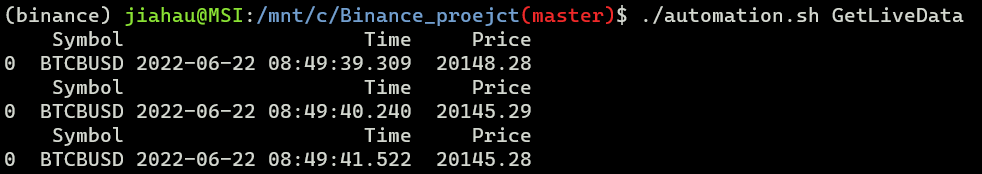
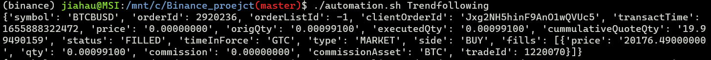

# The proejct of algorithmic trading

Example of executing the automation.sh script.

Open two terminals. One for receiving data from Binance API. The other is for executing strategies.

Here is the manual of the automation.sh file. It contains keys for activating the corresponding scripts:

Key table:
- GetLiveData: Run the GetLiveData.py to get live data from Binance API
- Trendfollowing: Run the trendfollowing.py to use a trend following strategy
